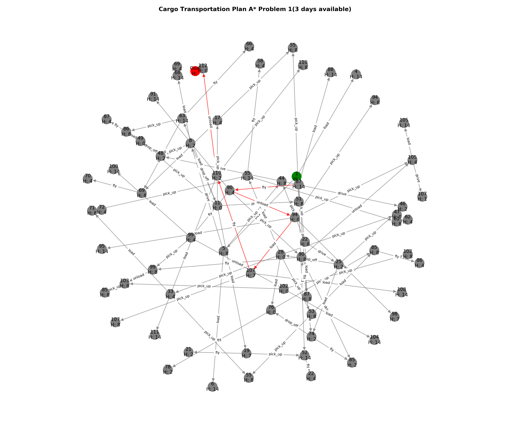

# _AI Planning: Cargo transport_

This project, models a planning problem using PDDL. 
The project aims to compare various planners in order to identify the most optimal plan for the cargo transport problem. This will be achieved through the implementation of a Python solution utilizing the NetworkX library. The results obtained from different planners will be evaluated and compared.

---

### Folder structure:
  - #### graphs: This folder encompasses all the photographs generated utilizing the scripts `grapher.py` and `grapher_visualiser.py`.
  - #### pddl: This folder contains all the PDDL problem and domain files I created for the planning problem.
    - #### [All-cost](https://github.com/MOHYAZZZ/ai-planning/tree/main/pddl/All-costs)
    - #### [Cargo-transport-noCost](https://github.com/MOHYAZZZ/ai-planning/tree/main/pddl/Cargo-transport-noCost)
    - #### [Cargo-transport-withCost](https://github.com/MOHYAZZZ/ai-planning/tree/main/pddl/Cargo-transport-withCost)
    - #### [Distance_transport](https://github.com/MOHYAZZZ/ai-planning/tree/main/pddl/Distance_transport(latest_Domain))
    - #### [capacity-transport](https://github.com/MOHYAZZZ/ai-planning/tree/main/pddl/capacity-transport)
  - #### Planner: This folder contains all the Python files, encompassing problem sets, the a_star_planner, and a graph visualizing tool that assists in understanding the workings of the planner.
  - #### templating: This folder containes a python script that reads a pre-existing PDDL template file (template.pddl) and generates a new PDDL problem file (Problem1.pddl) using the Jinja2 templating engine.
---
## How to run the python a_star_planner:
### Running the A* Planner to find the optimal solution for problems defined in state_definitions.py:
### 1. Installing all the necessary python packages
#### 1.1 [NetworkX](https://networkx.org/documentation/stable/index.html)
```
pip install networkx
```
#### 1.2 [Matplotlib: Visualization with Python](https://matplotlib.org/stable/#)
```
python -m pip install -U matplotlib
```
> ⚠️ **IMPORTANT NOTE:** Before running the `a_star_planner` Python file, ensure the correct problem is imported at the start of the file. All problems are clearly labeled and progressively increase in complexity, which may result in longer run times.


### 2. Simply run the python (a_star_planner.py) file.
#### This outputs the optimal plan of the problem, with number nodes generated in the A* search and the time taken.
---
## How to use different planners for PDDL files:
### 1. A Cloud-based Planner based on Fast forward(FF) provided as the **default planner** in the VScode extension. 
### This planner can be easily run using the following steps:
* #### Install the [PDDL extension](https://marketplace.visualstudio.com/items?itemName=jan-dolejsi.pddl) for Visual studio code.
* #### Open the problem file you would like to plan.
* #### Press Alt + P and select press enter to use the default planner.
* #### You should be able to see the planner output on the right side as a separate window.
### 2. [Fast Downward(FD)](https://www.fast-downward.org/)
> **_NOTE:_** I recommend using Linux-based operating systems to run this planner. The instructions below are for Linux.

### To install the FD planner on your machine, please follow these steps:
* #### Open the terminal and type the following command:
```
git clone https://github.com/aibasel/downward.git DIRNAME 
```
#### By doing this, a copy of the Fast Downward master repository will be created in the directory DIRNAME.
#### Let's assume you chose FastDownward as DIRNAME
* #### Change to the FD directory and compile the planner by typing the two commands below:
```
  cd FastDownward
```
```
  ./build.py
```
#### The default build release will be produced and placed in the Fastdownward/builds directory.

### 2.1 Running IPC planners based on Fast Downward:
### To run the LAMA planner, please follow these steps:
* #### Ensure you are in the same directory as the one you cloned in the Fast downward master repository. 
* #### Copy and paste the domain and the problem files to the same folder.
* #### Type in the following command in the terminal to run the LAMA configuration.
``` 
/fast-downward.py --alias lama Domain.pddl Problem.pddl
```

* #### The lama planner will then plan the problem and create the output files.
### 2.2 Running other Fast Downward configurations
#### Here are some examples of configurations that are available:
#### 2.2.1 **_A (ASTAR):_** Runs A* search algorithm which is guaranteed to find the optimal solution if one exists. To use A* with Fast Downward, you can run the following command: 
```
./fast-downward.py Domain.pddl Problem.pddl --search "astar(lmcut())"
```

#### 2.2.2 **_FF Heuristic:_** Runs Fast Forward planner.
#### To use the FF heuristic with Fast Downward, you can run the following command:
```
./fast-downward.py Domain.pddl Problem.pddl --search "astar(ff())" 
```
---
## Technologies used in this project:
### **1. Validator Tool:**
### VAL is a set of tools for AI planning models and plans, including a PDDL parser and a planner validator.
### Below you can find different commands and their usage that I found helpful for my project.
> **_NOTE:_** Clone the [VAL git repository](https://github.com/KCL-Planning/VAL) and Build the VAL tools first.
### 1.1 To validate a PDDL plan file against a PDDL domain file and a PDDL problem file, use the validate tool with the following command:
```
./validate domain.pddl problem.pddl plan.plan
```
#### Note that the plan file should be in the format specified by the PDDL standard, which is a list of actions or events in temporal order.
### 1.2 To validate multiple plans at the same time simply use the command below:

```
./validate -t 2 domain.pddl problem.pddl plan1.plan plan2.plan
```
### 1.3 Use the following command to gain more insight into what is going on during your plan's (theoretical) execution or to validate a hand-coded plan:
```
./validate -v -t 0.001 domain.pddl problem.pddl plan.plan
```
### 1.4 Use the following command for generating LaTeX file that visualizes the plan and changes of actions values throughout the plan.
```
./validate -l -f report -t 0.001 domain.pddl problem.pddl plan.plan
```
### 1.5 If you wish to convert the .tex file created with the command above to a .pdf file, first, you need to install [MiKTeX](https://miktex.org/download) and then run the following command:
```
pdflatex report.tex
```
> **_NOTE:_** Please note all the above information was taken from the [VAL repository](https://github.com/KCL-Planning/VAL/blob/master/applications/README.md), and please follow the link for other applications of VAL.

### **2. Jinja templating tool:**
### Please refer to the report in the reports branch on why and how I used jinja2 in my project.
### 2.1 To use Jinja2 and run the python script, you should simply install the python packages using the command below:
```
pip install jinja2
```
#### This will download and install the Jinja2 package and its dependencies.
### 2.2 Simply run python file.
#### Python script will render the Jinja2 template and replace the placeholders with actual values.

---
## Appendix

Here you can find some images showcasing the workings of the graph visualizer:

### Graph 1


### Graph 2



### Graph 3

